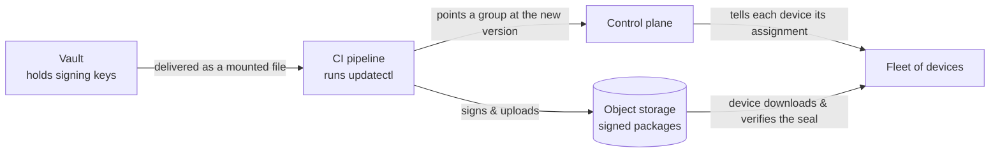

# Shipping Signed Updates to Your Fleet — Setup Guide

*A plain-language guide for platform owners, engineering managers, and security stakeholders. No prior knowledge of the internals required.*

---

## What this gives you

Every time your team finishes a new version of the software, it can be **signed, published, and rolled out to the whole fleet automatically from your CI pipeline** — with three guarantees:

* **Authenticity** — a device only accepts an update that carries your organization's cryptographic signature. A forged or tampered build is rejected.
* **No secret sprawl** — the master signing keys live in one vault. They are never copied onto laptops, never checked into code, and never held by the servers that orchestrate the rollout.
* **Controlled blast radius** — you decide which group of devices gets a version and when. A new version goes where you point it, not everywhere at once.

The tool that does the work is a small command-line program called **`updatectl`**. Your CI pipeline runs it; nobody has to run it by hand for day-to-day releases.

---

## The pieces, in one line each

| Piece | What it is | Who owns it |
| --- | --- | --- |
| **Vault** | A secure safe that holds your master signing keys | Security / Platform |
| **Kubernetes** | The system that runs your services and delivers the keys to the pipeline | Platform |
| **Object storage (S3)** | Where the signed software packages are published for devices to download | Platform |
| **Control plane** | Decides which device group runs which version | Platform |
| **`updatectl`** | Signs a build and points a group at it, from CI | Used by CI |
| **The fleet** | Your devices/servers that install the updates | The business outcome |

---

## How trust works (the one idea worth understanding)

Think of it like a **notary's seal**.

1. You create **one master seal** — the "trust root." Its private half is locked in Vault.
2. Every software package your team ships is **stamped with that seal** before it leaves CI.
3. Every device is told, once, **what the genuine seal looks like** (the public half).
4. From then on, a device installs a package **only if the seal matches**. Nothing else — not the network, not the servers in between — is trusted to vouch for a build.

> **Two consequences that matter to the business:**
>
> * **The orchestration servers never hold the keys.** They route and schedule; they cannot forge a release. Only something with Vault access can sign.
> * **Verification happens on the device, every time.** There is no "trust me" mode in the middle. This is deliberate and cannot be switched off.



---

## Setup: the one-time steps

This happens **once**, when you stand the system up. Budget a short session with your Platform and Security teams.

1. **Decide your groups and policy** *(Business + Platform)* — Agree on how you want to segment the fleet — for example *early-adopter*, *standard*, and *conservative* groups — and any rules such as "only roll during business hours." These are knobs the control plane already supports; you are choosing the policy, not building it.

2. **Provision the storage and control plane** *(Platform)* — Stand up the object-storage bucket that will host published packages, and deploy the control plane into Kubernetes. This is standard infrastructure work.

3. **Mint the master trust root** *(Security)* — Run the bootstrap command **once**. It creates the master signing keys, initializes the storage, and prints a small **"public seal" file** (`root.json`):

   ```bash
   updatectl trust-root \
     --keys-dir ./new-keys \
     --bucket <your-bucket> --region <your-region> \
     --root-out root.json
   ```

   * **`--keys-dir` must be a new, empty directory.** This is the one command that mints keys, and it mints *all* of them fresh; it refuses a directory that already holds any of them rather than reusing one, so a new trust root can never inherit an old or planted key.
   * **If the command fails, or you interrupt it, just run it again.** No key file is written to `--keys-dir` unless the publish lands, so the retry is the identical command. An interrupted run (Ctrl-C, a CI timeout) can leave one hidden staging directory of keys for the repository it never published; the next run removes it automatically and says so — there is nothing to clean up by hand.
   * **The seal is printed as soon as the storage is initialized**, before the keys are moved into `--keys-dir`. If the command then fails while placing the keys, it says so explicitly: the repository *is* published and the seal you have is the real one (it is also always fetchable from `metadata/root.json` in the bucket) — follow the message to collect the keys from the staging directory it names.
   * **Store the keys in Vault:** Move the files in `./new-keys` into Vault and delete the local copies. From here on, Vault is the only place the keys live.
   * **Register the public seal:** Give the `root.json` file to the Platform team; it gets attached to each device group's configuration. This teaches every device which seal is genuine.

   > **Critical warning:** Whoever runs this step briefly handles the master keys. Do it on a trusted machine, with your Security team, and confirm the keys are securely in Vault and erased locally before moving on.

4. **Connect Vault to the pipeline** *(Platform)* — Configure Vault to deliver the signing keys into the CI pipeline's environment as a **read-only mounted folder** (a standard Vault + Kubernetes integration). The pipeline reads the keys from that folder; it never talks to Vault directly and never stores them permanently.

5. **Wire `updatectl` into CI** *(Platform)* — Add one step to the release pipeline that runs the per-release command. Configure it through environment variables so there is no long command line to maintain.

---

## Every release after that (automatic)

When your team ships a new version, the pipeline runs a single command:

```bash
updatectl deploy \
  --keys-dir <the Vault-mounted folder> \
  --bucket <your-bucket> --region <your-region> \
  --group <which group to update> \
  --product <your product> --version <the new version> \
  --entrypoint <the program to launch> --source <the built files>
```

Behind the scenes, in seconds, this:

1. **Packages** the freshly built software.
2. **Signs** it with the master seal (keys read from the Vault-mounted folder).
3. **Publishes** it to storage.
4. **Points the chosen group** at the new version.

The control plane then hands each device in that group its new assignment, the device downloads the package, **verifies the seal**, and installs it. Roll to one group first, confirm it is healthy, then roll the next — the control plane tracks this for you.

---

## What you can tell your stakeholders

* **"Only we can ship."** A release requires the master keys, which live only in Vault. Compromising a build server is not enough to push malware to the fleet.
* **"Every device checks every update."** Verification is on the device and always on.
* **"Releases are hands-off and auditable."** They flow through CI like any other pipeline step, with a record of what shipped, when, and to whom.
* **"We control the rollout."** New versions go to the groups you choose, on the schedule you set — not to everything at once.

---

## Who owns what

| Task | Owner | Frequency |
| --- | --- | --- |
| Choose fleet groups & rollout policy | Business + Platform | Once, revisit as needed |
| Provision storage & control plane | Platform | Once |
| Mint the master trust root, load keys into Vault | Security | Once |
| Register the public seal on each group | Platform | Once (per group) |
| Connect Vault → pipeline (mounted keys) | Platform | Once |
| Add the release step to CI | Platform | Once |
| Ship a new version | CI (automatic) | Every release |
| Rotate/replace the master root | Security | Rare, deliberate |

---

## A note on "throwaway" roots and expiry

For a short-lived, one-off distribution you can mint a **temporary** trust root, sign a build with it, and discard the keys. That works exactly like the normal flow — the device still verifies the seal — with one caveat: **signed material carries an expiry date** (default one year). If you discard the keys you cannot re-sign, so a throwaway root lasts only as long as its window. For anything you will update again, **keep the keys in Vault.**
