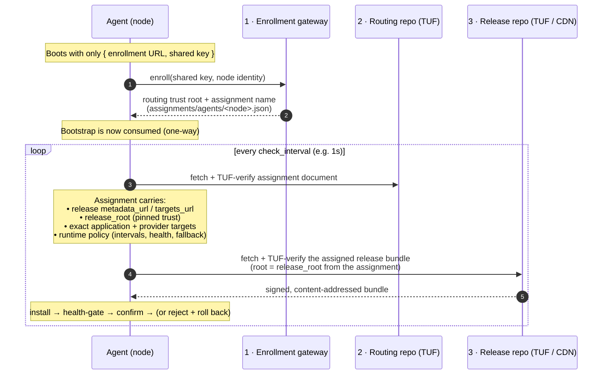
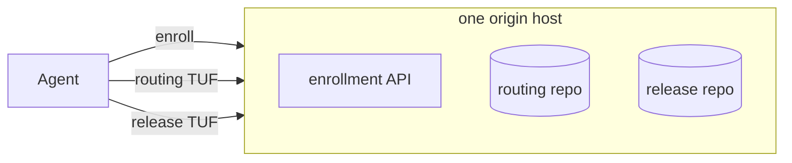
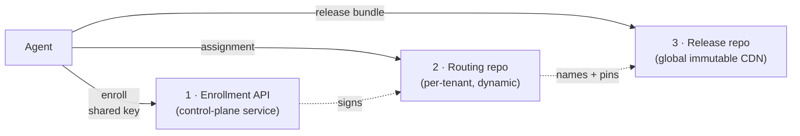
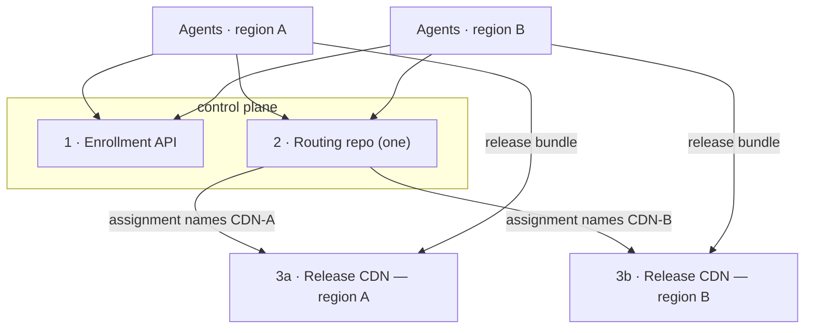
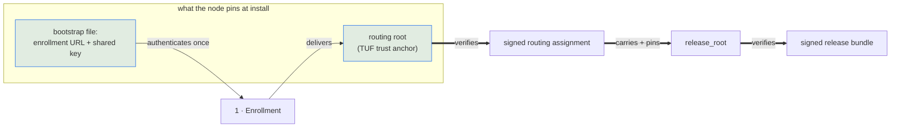

# Fleet rollout: the three endpoints

This document explains the `updated` fleet-update system as if it were running in a
hypothetical production environment. The live demo (`updatec-demo`) is one concrete
wiring of exactly this architecture, with all three endpoints collapsed onto a single
in-cluster host — see [The demo mapping](#the-demo-mapping) at the end.

The central idea: **an agent hardcodes almost nothing about where its software comes
from.** It is born knowing only how to *enroll* and where its *routing* repository is.
Everything else — which release CDN to pull from, which trust root to use for it, which
exact version it is assigned — arrives as a **signed document** it fetches at runtime.
That indirection is what lets the three endpoints below be the same host or three
different CDNs, and lets operators move or shard the release CDN without ever touching a
node.

---

## The three endpoints at a glance

| # | Endpoint | What it serves | Trust anchor on the node | Who writes it | Cardinality |
|---|----------|----------------|--------------------------|---------------|-------------|
| 1 | **Enrollment gateway** | A dynamic API. A cold node presents a shared secret and receives its routing trust + its assignment pointer. | The enrollment URL + shared key in the two-line bootstrap file. | The control plane (operator). | One per control plane. Usually a *service*, not a CDN. |
| 2 | **Routing repository** | A small TUF repository of **per-node assignment documents** (`assignments/agents/<node>.json`). Each assignment names the release CDN and pins its trust. | A routing TUF **root** pinned at install (`Routing.root`). | The control plane signs assignments here. | One per fleet/tenant. Small, changes on every rollout. |
| 3 | **Release repository** | A TUF repository of **immutable release bundles** — the application, its provider set, and supervisor self-updates. | A release TUF **root** that is *not* in local config — it is `release_root`, signed **into** the routing assignment. | The release publisher signs bundles here. | Often one large, shared, cache-friendly CDN. Changes rarely. |

The load-bearing detail is in the last two rows. From `crates/updated/src/config.rs`:

- The routing repo's `base_url` is *"the only repository URL configured on a node"*.
- The release repo's URLs *"deliberately do not live in local config"* — they are
  `metadata_url` / `targets_url` carried inside the signed `RepositoryAssignment`, and
  its trust root is the `release_root` embedded in that same signed document.

So the node trusts the routing repo directly (pinned root), and trusts the release repo
*transitively* — because the routing repo, which it already trusts, signed a document
that says "here is the release CDN and here is its root."

---

## How a node reaches a release (the pull chain)

Two independent TUF verifications happen here, with two independent roots:

1. The **routing** assignment is verified against the pinned **routing root**.
2. The **release** bundle is verified against the **`release_root`** that the (already
   trusted) routing assignment delivered.

An attacker who compromises the release CDN still cannot ship bytes a node will run: the
bundle must match a target hash named in release metadata signed by keys chained to
`release_root`, and that root was handed to the node inside a routing document signed by
the routing keys. Neither CDN, by itself, is trusted to name arbitrary bytes.

---

## Same host, or three different CDNs?

Because the node only pins endpoints **1** and **2**, and learns **3** at runtime from a
signed document, the three can be deployed anywhere on the spectrum from "one box" to
"three independently operated CDNs."

### A · Collapsed — one host serves all three

The simplest topology (and what the demo uses). Fine for dev, single-tenant, or airgapped
appliances.

### B · Split by role — the common production shape

Enrollment is a **dynamic API** (it authenticates and mints per-node documents, so it
can't be a dumb cache). Routing is a **small, per-tenant** TUF repo that changes on every
rollout. Release is a **large, mostly-immutable** artifact store that fronts well behind a
global CDN.

Why operators want this split:
- The **release CDN** carries the bytes and the traffic. Making it immutable and
  content-addressed means it caches perfectly and can be a commodity CDN — and it can be
  swapped or re-pointed by publishing a new routing assignment, with **zero** node
  reconfiguration.
- The **routing repo** holds the per-node policy and is where rollouts actually happen.
  It is tiny and high-churn; keeping it separate from the release bytes keeps rollout
  operations cheap.
- The **enrollment API** is the only component that must be online-authenticated and
  stateful. It is not on the hot path — a node enrolls once.

### C · Sharded release, shared routing — multi-region / multi-vendor

Different cohorts can be pointed at different release CDNs *without any node knowing*,
simply by signing different `metadata_url` / `release_root` values into their assignments.

Here endpoint **3** is genuinely *different per node*, chosen by the signed assignment,
while endpoints **1** and **2** are shared. A region migration is a rollout, not a fleet
re-config.

---

## What each endpoint is trusted for (and not)

- **Enrollment** is trusted to authenticate a node and hand it a *routing root* and an
  *assignment name*. It never names release bytes.
- **Routing** is trusted (via the pinned routing root) to name the release CDN, pin its
  root, and select the exact assigned version + runtime policy. It never serves release
  bytes.
- **Release** is trusted (via the `release_root` the routing repo pinned) only to serve
  bytes whose hashes match signed release metadata. It has no say over *which* version a
  node runs — that is the routing assignment's job.

This separation is also what makes the safety properties hold under the demo's chaos:
anti-rollback (version floor), exact-pin vs. signed ordered fallback, and content-hash
rejection all operate on the **release** repo, but the *authorization* to descend
versions (`ordered_install_fallback`) is signed into the **routing** assignment — so only
the publisher, never a compromised release CDN, can widen what a node will accept.

---

## The demo mapping

The `updatec-demo` "Live fleet rollout" screen is topology **A (collapsed)**:

| Concept | In the demo |
|---------|-------------|
| Enrollment gateway | The in-cluster `updatec` gateway; agents enroll with a shared secret over insecure in-cluster HTTP. |
| Routing repository | The same operator-managed TUF repo; each `demo-cohort-NN` group is a signed assignment the operator republishes when the demo patches its desired version. |
| Release repository | The same in-cluster repo bucket, holding the versioned sample-app bundles the demo publishes (`23.0.0`, `24.0.0`, … , the converged `101.0.0`). |
| Nodes | 80 stateless agent pods (16 cohorts × 5), `emptyDir` state — every restart is a cold enrollment, which is why signed `ordered_install_fallback` matters. |

Because all three are one host in the demo, the diagram collapses — but the *code paths*
are identical to the split topologies above. The agent still enrolls, still fetches and
TUF-verifies a routing assignment, still resolves `release_root` from that assignment, and
still verifies the release bundle against it. The demo simply points all three URLs at the
same origin.
