# System state machines

This is a map of every state machine in the system and how they fit together — written to
hand to someone new. The system updates a fleet of nodes safely: a Kubernetes control plane
(`updatec`) publishes signed desired-state; each node's agent (`updated`) enrolls, installs,
and upgrades itself; a tiny guardian (`bootstrap`) supervises the agent's process and can even
replace the agent binary. Every machine below is **crash-safe** (journal-before-act, replay
idempotently) and **fails safe** (an unclear signal keeps the last known-good running).

## The three layers

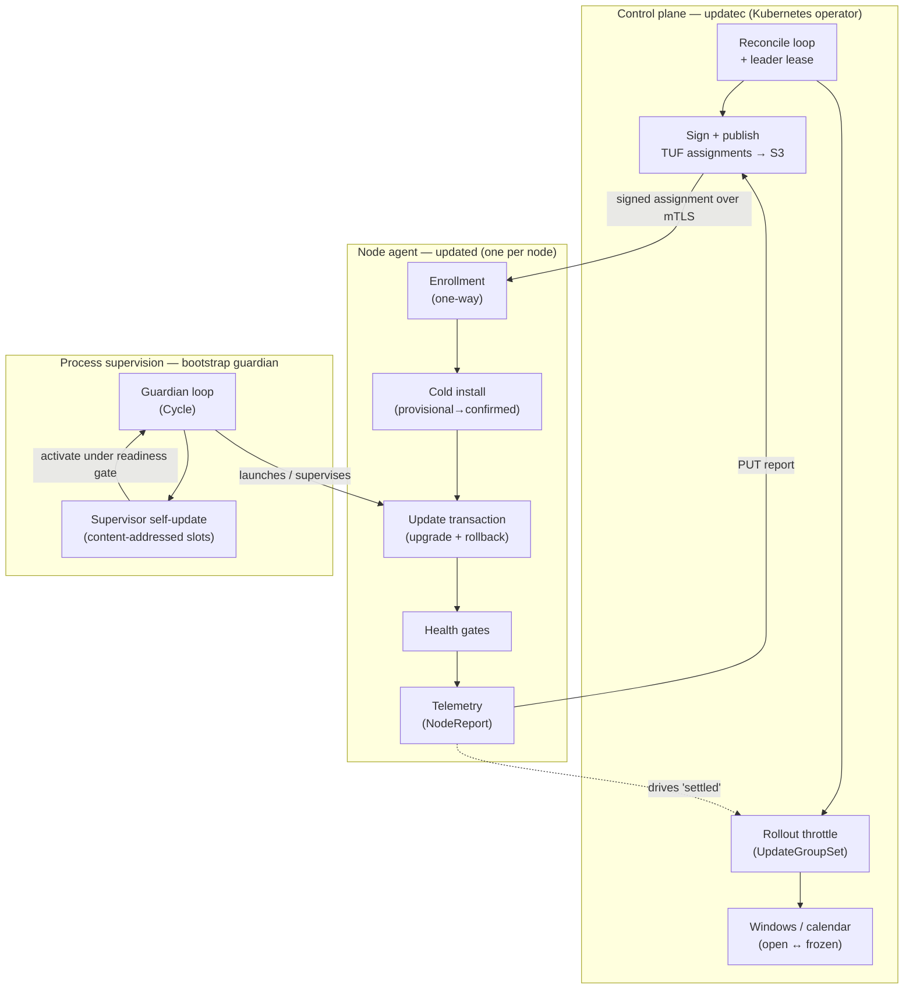

- **Control plane** decides *what* each group of nodes should run and *how fast* to roll it out.
  It never reaches into a node; it publishes signed TUF content and reads back node telemetry.
- **Node agent** pulls its assignment, installs/upgrades to it, proves health, and reports back.
- **Guardian** owns the OS process: it keeps the agent running, and swaps the agent binary itself
  under a readiness gate. It is transparent to the init system (systemd/launchd/Windows service).

The feedback loop is the whole point: control plane publishes → node converges → node reports
health → throttle admits the next group. Nothing polls the app directly; telemetry is the only
signal.

---

# Layer 1 — Control plane (`updatec`)

## 1. Reconcile loop + leader lease

One replica acts at a time, chosen by a Kubernetes `Lease` (`updatec-publisher`, 15s). The loop
is leader-elected, reconciles once, and polls every ~1s so a freshly edited CRD republishes fast.

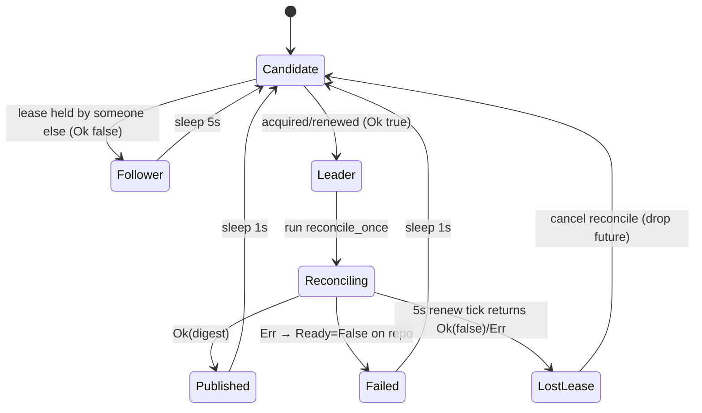

- **Lease** (`acquire_or_renew_lease`, `runtime.rs`): returns `true` (we hold it) or `false`
  (follower — never an error for contention). Optimistic concurrency: a `create`/`replace` 409 →
  `false`. Takeover bumps `leaseTransitions`; a self-renew preserves the original `acquireTime`.
- **`reconcile_once` pipeline** (all-or-nothing publication): list + validate CRDs → build the
  routing plan (`build_publication_plan`) → read node telemetry → **apply throttle** → rebuild the
  plan from throttled groups → if the plan digest is unchanged, skip signing but still refresh
  statuses; else **sign the TUF metadata and upload to S3** (`timestamp.json` last = the commit
  point) → publish per-resource statuses.
- **Quarantine (fail-open per resource):** one malformed `UpdateGroup` (empty selector / invalid
  deployment) or `UpdateAgent` (bad identity / matches >1 group) gets `Ready=False` on *its own*
  status and is dropped from this generation — the rest still publish.

## 2. Rollout throttle (`UpdateGroupSet`)

A group-set caps how many member groups roll at once (blast radius). It is **self-pacing**: a group
only frees its slot once every node in it reports the new deployment healthy.

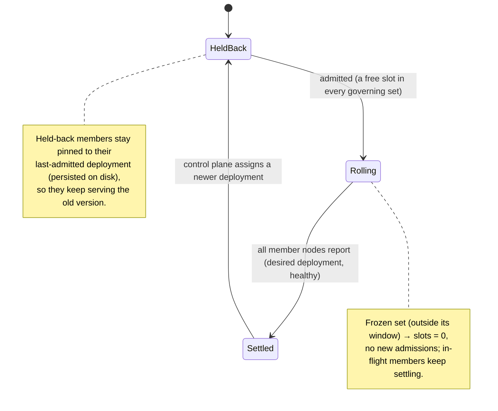

- **`max_concurrent`** defaults to `members - 1` (always keep one group known-good), clamped
  `1..=members-1`. Admission is most-constrained-first; a group in several sets is admitted only if
  **every** governing set has a free slot (tightest set wins).
- **`settled`** is derived purely from telemetry: a group is settled iff *all* its nodes have a
  fresh `NodeReport` with `deployment == published && healthy`. A missing/stale report ⇒ not settled
  ⇒ the slot stays held (fail-safe). This is the loop that lets the next group start the instant one
  finishes.
- **Degrade:** a group whose deployment has no `report_url` can't be gated, so the set rolls
  unthrottled (and logs it).

## 3. Rollout windows / calendar (open ↔ frozen)

Two independent schedules gate admission, combined by **intersection** (both must allow):

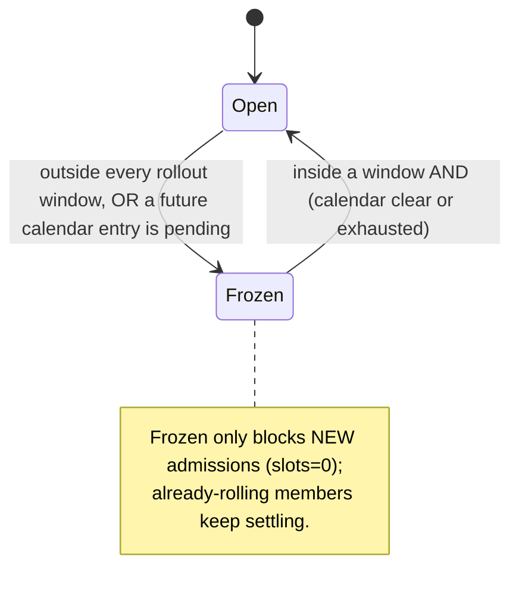

- **Recurring windows** (UTC `HH:MM` spans, weekday/biweekly/N-weekly, may wrap past midnight):
  empty ⇒ always open; open if *any* window is active. Unparseable ⇒ closed (fail-safe).
- **One-off calendar** (absolute dated maintenance windows): no entries ⇒ open; inside an entry ⇒
  open; **all entries in the past ⇒ open** ("calendar ran out"); a pending future entry ⇒ closed.

---

# Layer 2 — Node agent (`updated`)

## 4. Enrollment (one-way, consumed-once)

A fresh node authenticates to the gateway, receives a signed bundle (its routing root + first
assignment), and records a **consumed** marker it can never undo. Two modes, chosen by which
credentials the bootstrap carries.

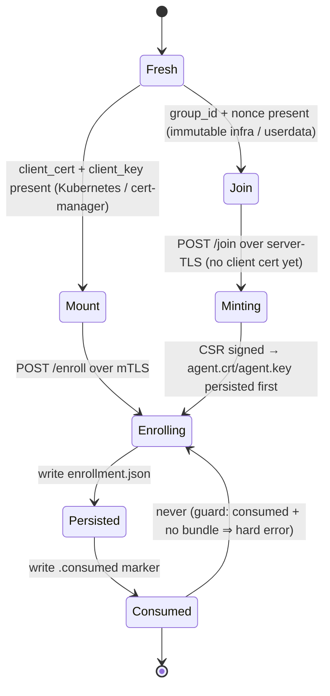

- **Mode precedence** (`EnrollmentBootstrap::mode`): cert paths win over a join token; a
  half-specified pair is an error; resolved at load so a misconfig fails immediately.
- **On-disk state:** `registration-nonce` (durable per-node id, reused on retry), `agent.crt`/
  `agent.key` (join-mode minted identity, key `0600`), `enrollment.json` (the bundle),
  `enrollment.consumed` (permanent "never re-enroll").
- **Write ordering is the crash-safety hinge:** the bundle is written **before** the consumed
  marker (a crash between → next boot loads the bundle, then writes the marker; the reverse order
  could brick with "consumed but no bundle"). In join mode the minted **cert is persisted before**
  the bundle (a crash between simply re-joins to the same identity, since the durable `instance`
  is stable).
- **Control-plane side:** `/enroll` (mTLS handshake *is* the auth) and `/join` (group token +
  CSR) both create an `UpdateAgent`. Join additionally mints the client cert: the CA **ignores the
  CSR subject**, certifies only its public key, and sets `CN` + a SPIFFE URI SAN
  (`spiffe://updated.fleet/group/<group>/node/<agent>`). The agent name is
  `agent-<first 24 hex of sha256(instance)>` in both modes.

## 5. Cold install (provisional → confirmed)

The **first** install has no predecessor to fall back to, so it uses a forward-only journal and
commits the head **provisional** — unproven until a health gate passes. If the head is bad, it is
rejected and the agent **descends** to the next lower installable release (ordered fallback).

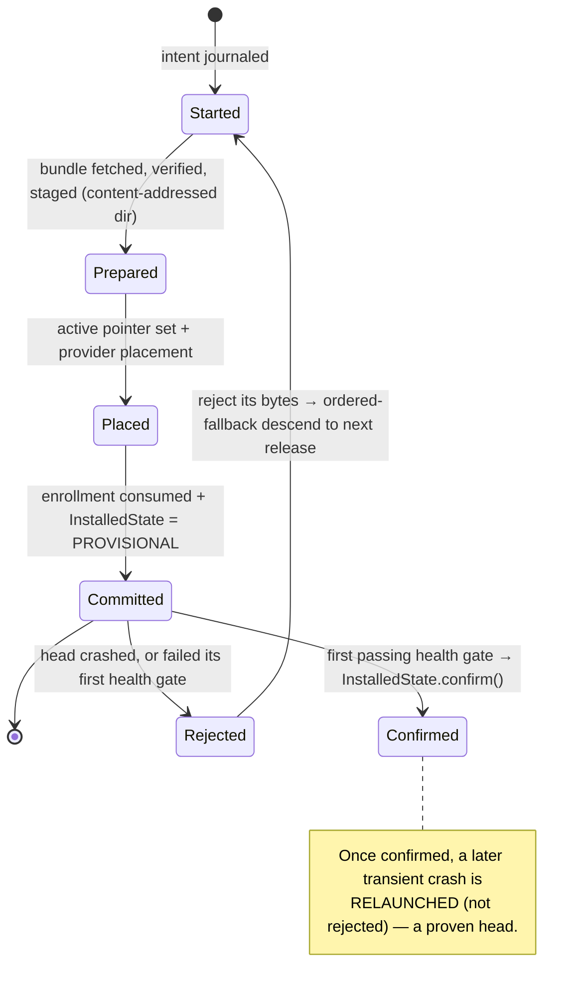

- **`InstalledState.confirmed`** is the pivot of the whole safety model:
  - *provisional* (`confirmed=false`): recovery is **cold-install ordered fallback** (descend).
  - *confirmed* (`confirmed=true`): recovery is the **update machine's rollback** to a proven
    predecessor. A provisional head may never carry a pending rollback (nothing to revert to).
- **Rejections** are content-addressed and permanent (keyed `lineage:sha256` for apps): republish
  a fixed bundle (new digest) to clear, or drop a `.allow` break-glass file for exact bytes.
- **Fail-open floor:** if the descent empties out but a release is already committed on disk, the
  agent **holds the committed release** rather than bricking.
- **Cold vs upgrade vs reinstall** is decided by state, not a flag:
  - **Cold** = nothing installed → this machine.
  - **Upgrade** = a confirmed release present → the update transaction (§6).
  - **Reinstall** = a *provisional* head that is now rejected with no in-flight update → re-runs
    cold install to descend past it.

## 6. Update transaction (upgrade) + rollback

An upgrade over a *confirmed* release is a journaled lifecycle with a mirror-image rollback path.
Each phase pairs a durable journal write with a live action (drain traffic, stop, swap pointer,
start, health-gate, finalize), so a crash resumes at the last durable boundary.

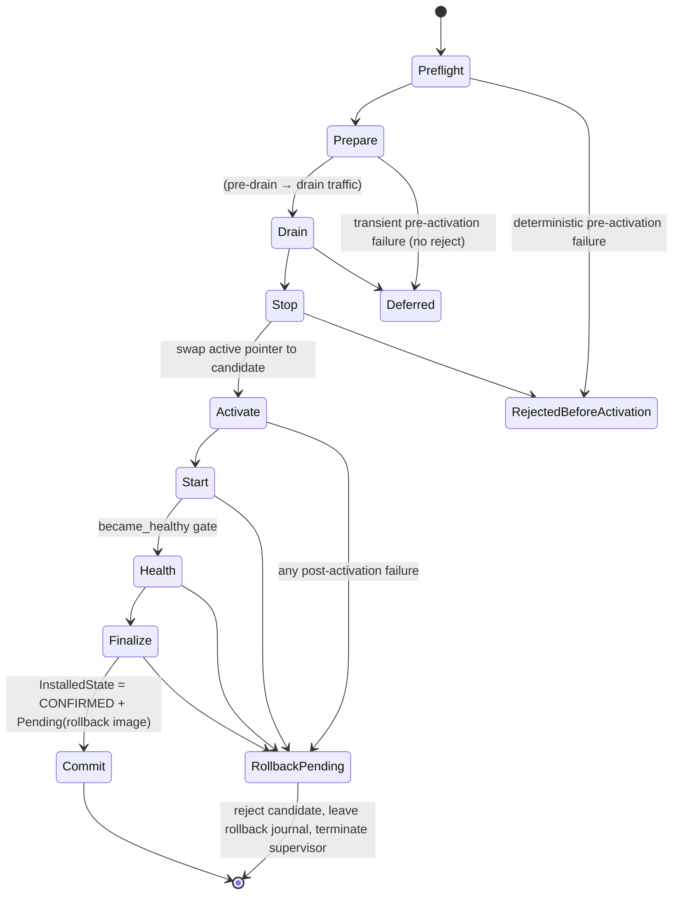

- **Outcomes** (`Outcome`): `Committed`, `RollbackPending`, `RejectedBeforeActivation`, `Deferred`.
- **Before activation**, failures that are the provider's fault (Preflight/Stop) **reject** the
  candidate bytes; transient ones (Prepare/Drain) just **defer** (retry later, no reject).
- **After activation**, any failure rejects the candidate, leaves the durable rollback journal in
  place, and returns `RollbackPending`. There is **no in-process rollback**: the supervisor
  terminates cleanly (`AppOutcome::RestartForRecovery`), the guardian relaunches it — keeping the
  failed application alive across the restart — and **boot recovery** performs the one rollback.
  This is deliberate: a restart is cheap, and a live-tower rollback would be a second rollback path
  to keep in lockstep with boot recovery (and would gate the restored predecessor with the
  *candidate's* health provider rather than the predecessor's). One path, one set of providers.
- The rollback machine itself lives in **boot recovery** (§9): a `RestorePredecessor` journal is
  driven `RollbackStarted → …Stopped → PredecessorActivated → PredecessorStarted →
  PredecessorHealthy → RolledBack`, journaled so a crash mid-rollback resumes piecewise
  (rank-driven). The journal a post-activation failure leaves is byte-identical to the one a
  *crash* immediately after activation would leave, so both converge on the same recovery.

## 7. Confirmation window (survive-to-confirm, else revert)

A committed upgrade is `confirmed=true` but carries a **`Pending`** rollback image and a
`committed_at` timestamp. It must *survive* a confirmation window before the predecessor is
discarded.

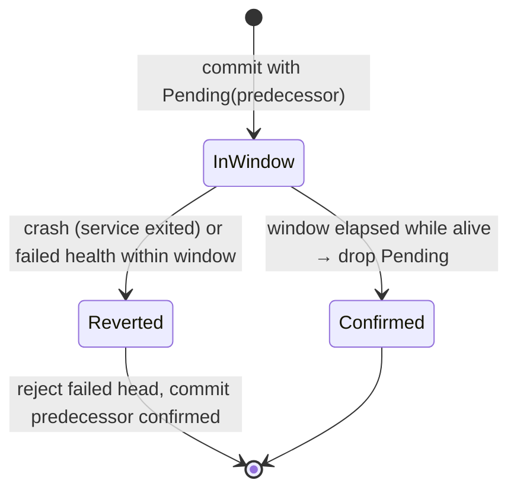

- Revert triggers: **crash before confirm** (guardian recorded a service exit → boot reverts to
  `pending.previous_release` and rejects the failed bytes), **failed health gate**, **window not yet
  passed** at boot. Every revert runs through **boot recovery** (there is no in-process rollback).
  Survival past `committed_at + window` ⇒ confirm.
- The `Pending` image (predecessor release + *its* providers) is folded into the single atomic
  commit write — there is no separate "arm rollback" step that a crash could interrupt.

## 8. Health gates

`became_healthy` gates every (re)start and every candidate. Three check kinds exist
(`Startup`, `Readiness`, `Liveness`); the update/boot path uses the readiness-style gate.

```mermaid
stateDiagram-v2
    [*] --> Grace: (re)start; wait within health_grace window
    Grace --> Probing: probe health URL
    Probing --> Counting: 2xx (+ optional token/version match)
    Probing --> Grace: non-2xx → reset streak
    Counting --> Healthy: consecutive successes ≥ health_successes
    Counting --> Probing: space by health_interval, probe again
    Grace --> Failed: deadline exceeded → gate fails (reject / rollback)
    Healthy --> [*]
```

- Fields: `health_grace` (time to come up), `health_successes` (consecutive good probes, default 1),
  `health_interval` (spacing between confirmations). No URL ⇒ sleep the grace and pass.
- A passing gate is what flips a **provisional** cold-install head to **confirmed** (§5) and what
  a candidate upgrade must clear before `Health → Finalize` (§6).
- Optional identity check: the app may echo its launch token + version; present-but-wrong fails,
  absent-but-2xx is trusted.

## 9. Telemetry (the feedback signal)

The supervisor heartbeats a `NodeReport { node, deployment, version, healthy, reported_at_ms }` by
PUT to its assignment's `report_url` (the gateway persists it to the object store). `healthy` means
*settled*: installed, confirmed, and the app's health gate passing — `false` while an update is
in-flight. The control plane reads these back to drive the throttle's `settled` (§2). A report
older than `REPORT_FRESHNESS` (60s) reads not-ready (fail-closed).

The **healthproxy** consumes the same reports to program a load balancer's membership
(EndpointSlice `ready`): `report_is_ready` requires a fresh, healthy report *for that node*, else the
backend is drained. It never sits in the data path — it programs membership; kube-proxy forwards.

---

# Layer 3 — Process supervision (`bootstrap` guardian)

## 10. Guardian supervision loop

The guardian keeps the agent (supervisor) process running and is **transparent to the init
system**: it forwards a stop down to the app and rolls the app's exit code up, so a crash-looping
update is caught by the *supervisor's* boot machine (§5–7), not by any loop here.

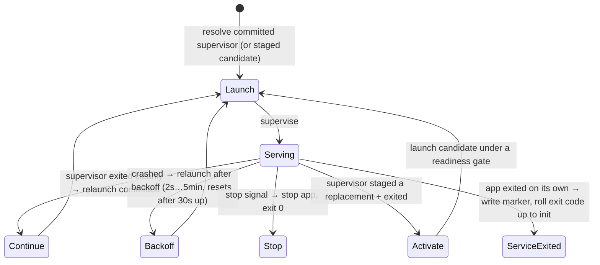

## 11. Supervisor self-update (content-addressed slots)

The supervisor replaces *itself* by staging a new binary into an installer-owned, content-addressed
slot (`supervisors/<sha256>/`) — never in place — and handing off to the guardian, which activates
it under the same readiness/confirmation gate it uses for the app.

```mermaid
stateDiagram-v2
    [*] --> Staged: newest signed supervisor whose bytes ≠ mine → verify → slot dir
    Staged --> HandOff: guardian.replace_supervisor(path); supervisor exit(0)
    HandOff --> Candidate: guardian launches candidate (Cycle::Activate)
    Candidate --> Committed: sends Ready(nonce) before ready_timeout AND survives confirm_timeout alive
    Candidate --> Rejected: ready timeout, or exits before/within confirmation
    Committed --> [*]: flip durable desired-supervisor pointer
    Rejected --> [*]: reject slot hash → relaunch committed supervisor
```

- Supervisor identity is its **content hash**, not a version. A rejected candidate's slot hash is
  suppressed so it is never retried. The **application process is untouched** across a supervisor
  swap — the guardian owns it separately, so the supervisor is disposable.

---

# How rollback works (all paths in one place)

"Rollback" means three different mechanisms depending on *what* is being reverted and *how far it
got*. The pivot is always: **is the current head proven (confirmed) or unproven (provisional)?**

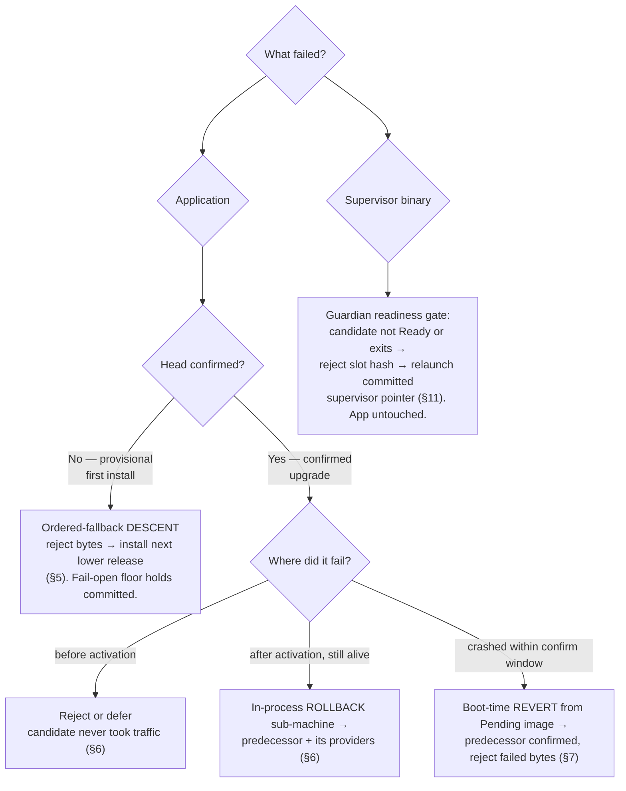

Everything above shares four guarantees:

1. **Journal before act.** Each machine writes its intent (install/update/rollback journal, or the
   durable pointer) *before* the side effect, and every step is idempotent, so a crash replays to
   the same place.
2. **Atomic activation.** State lands via write-temp → fsync → rename → fsync-dir; releases live in
   content-addressed dirs (`versions/<v>-<sha>`, `supervisors/<sha>`) so nothing is overwritten in
   place.
3. **Confirm on proof, revert on doubt.** A head is only trusted after a health gate; an unproven
   head is descended-past (provisional) or reverted-from (confirmed within window).
4. **Fail safe, never fail open.** Missing/stale/ambiguous signals hold the last known-good:
   telemetry gaps hold a throttle slot, a bad candidate keeps the predecessor, an empty descent
   holds the committed release, a lost lease cancels rather than double-publishes.

---

# End-to-end: one group's rollout

```mermaid
sequenceDiagram
    participant Op as Operator
    participant CP as Control plane
    participant S3 as Object store (TUF)
    participant Ag as Node agent
    participant Gd as Guardian
    participant HP as Healthproxy / LB

    Op->>CP: edit UpdateGroup → v2
    CP->>CP: reconcile (leader) → throttle admits group (free slot, window open)
    CP->>S3: sign + publish assignment (timestamp.json last = commit)
    Ag->>S3: fetch verified assignment (mTLS)
    Ag->>Ag: update transaction: drain → stop → activate v2 → start
    Ag->>Gd: (guardian keeps the process alive across the swap)
    Ag->>Ag: health gate: N successes within grace
    Note over Ag: pass → confirm after window; fail/crash → rollback to v1
    Ag->>S3: PUT NodeReport {deployment:v2, healthy:true}
    HP->>S3: read report → mark node ready in EndpointSlice
    CP->>S3: reconcile reads reports → group "settled" → free slot
    CP->>CP: admit the next group
```

---

## File map (where each machine lives)

| Machine | Primary code |
|---|---|
| Reconcile + lease | `updatec/src/{main,runtime}.rs` |
| Rollout throttle | `updatec/src/throttle.rs` (`SetStatus`) |
| Windows / calendar | `updatec/src/window.rs` |
| Enrollment | `updated/src/enrollment.rs`; `updatec/src/{gateway,join}.rs` |
| Cold install | `updated/src/install.rs` (`InstallPhase`); `supervisor/src/install.rs` |
| Update + rollback | `updated/src/transaction.rs` (`Phase`); `supervisor/src/update.rs` |
| Confirmation window | `updated/src/state.rs` (`InstalledState`, `Pending`); `supervisor/src/{boot,main}.rs` |
| Health gates | `updated/src/config.rs` (kinds/timeouts); `supervisor/src/app.rs` (`became_healthy`) |
| Telemetry | `updated/src/telemetry.rs`; `supervisor/src/telemetry.rs` |
| Healthproxy | `updated-healthproxy/src/{lib,endpointslice}.rs` |
| Guardian loop | `bootstrap/src/guardian.rs` (`Cycle`, `ActivationState`) |
| Supervisor self-update | `supervisor/src/self_update.rs`; `bootstrap/src/supervisor.rs` |

Related design docs: `docs/crash-safety-review.md` (provisional/confirmed deep-dive),
`docs/group-enrollment-design.md` (enrollment/join), `docs/fleet-rollout-endpoints.md`.
