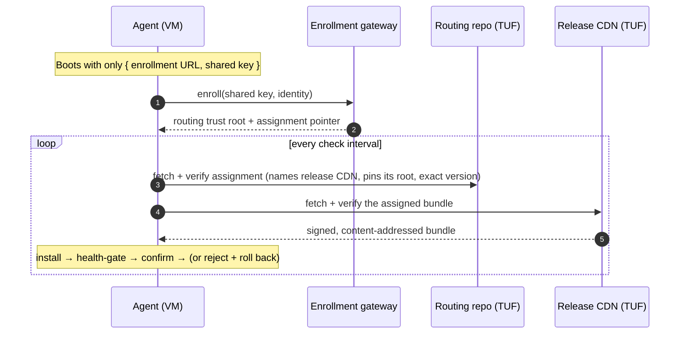
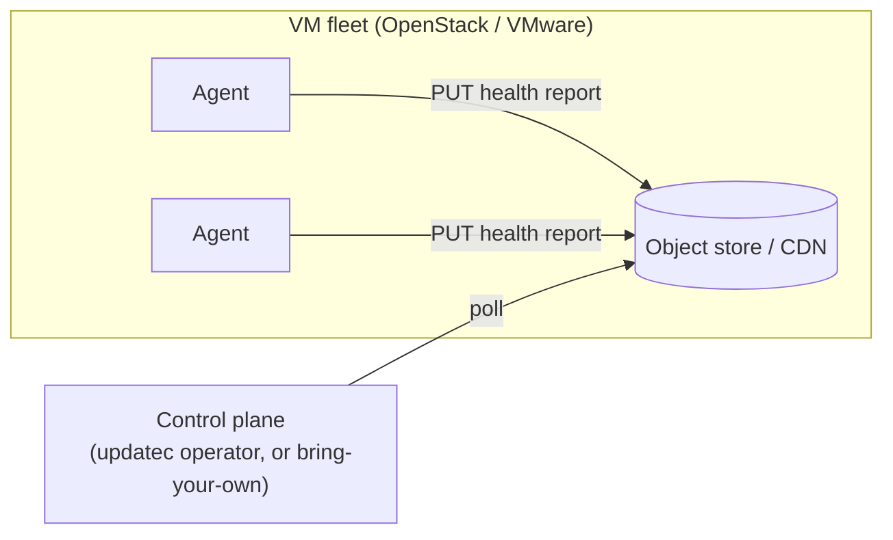
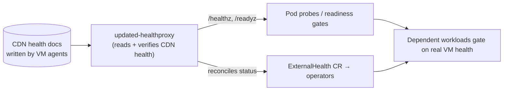

# `updated` — Kubernetes-grade lifecycle for our VM estate

*Internal brief · reliable, signed, self-healing application updates for OpenStack & VMware VMs*

---

## The gap we have today

We are a mixed estate, and it splits cleanly into two worlds:

| | **Containers (most of our estate)** | **VM-hosted applications (OpenStack, VMware)** |
|---|---|---|
| Rollouts | Declarative, throttled, automatic | Manual, ticketed, per-host scripts |
| Health gating | Readiness/liveness probes | Someone watches a dashboard |
| Bad release | Auto rollback in seconds | Emergency change, war room |
| Self-healing | Built in | A human |
| Audit | Native | Whatever the runbook captured |

Kubernetes gave the container world *rollouts, health gates, rollback, and self-healing* for free. **The VM applications never got any of it.** They're our oldest, often most business-critical software — and they're managed the way we managed everything a decade ago.

> The goal is **not** to move these apps into pods. Many can't or shouldn't move. The goal is to give the apps *where they already run* the same lifecycle guarantees our pods enjoy.

---

## What `updated` is

`updated` is update infrastructure for applications running **on Linux, macOS, and Windows VMs** — the ones in OpenStack and VMware. It installs and activates **signed, immutable release bundles**, health-gates every activation, and **automatically rolls back** anything unhealthy — without the application needing to be update-aware.

- **Immutable release bundles**, not loose files. Entrypoint, config, assets, helpers, and libraries ship under one signed, verified, rollback-safe identity.
- **Survives interruption at every durable boundary.** Power loss mid-update reconciles cleanly on restart.
- **Replaces its own supervisor** without stopping the managed application.
- **Trust anchored by [TUF](https://theupdateframework.io/)** — threshold signing, pinned-root rotation, rollback and freeze resistance. We don't reinvent the crypto.

The same mechanism installs and upgrades everything from a simple service to a genuinely elaborate enterprise Java deployment (compat preflight → state backup → generated config → load-balancer drain → stop → WAR activation → cache warmup → health verify → schema migration → traffic restore → rollback → audit receipt).

---

## The guarantees (this is the pitch)

Every one of these is enforced by the agent, on the VM, with no operator in the loop:

- A release **cannot execute** until TUF authenticates its metadata, platform, length, and digest, and every extracted file matches a strict manifest.
- Activation changes **one atomic record**; predecessor and candidate directories are never rewritten in place.
- Startup **reconciles interrupted updates** before it selects or launches anything.
- Failed activation or a failed health check **reactivates the predecessor and rejects the bad release** for a bounded retry window.
- A post-commit crash inside the confirmation window **also reverts**.
- Supervisor crashes and self-updates **do not stop the application**.
- An unreachable repository **does not stop an already-installed release from starting**.

This is the property set we normally only get from Kubernetes — now available to a VM in a VMware cluster behind three firewalls.

---

## How a VM gets its software

A node is born knowing almost nothing: only how to **enroll** and where its **routing** repository is. Everything else — which release CDN, which trust root, which exact version — arrives as a **signed document it fetches at runtime**. That indirection is the whole design.

Two independent TUF verifications, two independent roots. A compromised release CDN still cannot ship bytes a VM will run. Re-pointing a whole region to a different CDN is a *signed rollout*, not a fleet reconfiguration — **no VM is ever touched to change where its software comes from.**

---

## Manage the VM fleet **from Kubernetes**

We're mostly Kubernetes, so the control plane should live there. `updated` ships a Kubernetes operator, **`updatec`**, that lets us manage the VM fleet with the exact tools we already use — `kubectl`, GitOps, RBAC, CRDs:

- **`UpdateAgent`** — one per VM (they can represent agents *anywhere*, not just pods).
- **`UpdateRepository`** — the desired-version surface the operator signs into routing.
- **`UpdateGroup`** — a label-selected cohort of VMs.
- **`UpdateGroupSet`** — a label selector over groups with a `maxConcurrent` cap: **throttled, safe fleet rollouts** across the VM estate.

We patch desired state in Kubernetes; the operator signs a new routing generation and publishes it; the VM agents pull, verify, and activate. **The VMs never know why their config changed** — they just converge.

Rollouts are **crash-resistant**: the operator persists admitted state atomically before publishing and uses a single-writer lease, so a controller restart resumes the rollout exactly where it left off.

---

## Telemetry that works behind firewalls

Our OpenStack/VMware VMs are often unreachable from the cluster — NAT, security groups, separate networks. So the control plane **never calls the nodes**. Instead:

> **Agents *write* a signed health/telemetry document to an object store (CDN). The control plane *reads* it.**

This is a **generic "bring your own control plane" contract** — a small, documented HTTP surface (`enroll`, `telemetry`). The Kubernetes operator implements it, and so does a standalone server, so nothing about the model is Kubernetes-locked. It's the piece that makes managing firewalled VMs actually work: report-out, poll-in, no inbound path to the fleet.

---

## The missing piece we should build next

**A health-check proxy executable** that turns CDN-reported VM health into **native Kubernetes health**, so Kubernetes can orchestrate *other* items against it.

**Why:** today the VM health lives in the object store, readable by our control plane. But most of our platform reacts to *Kubernetes* health — readiness gates, probes, operators, `Service` endpoints, `Job` preconditions. A pod that depends on a VM-hosted database, license server, or legacy Java app has no native way to wait on that VM's real health.

**What it does:** a small binary (working name `updated-healthproxy`) reads the same signed per-node health documents agents already publish to the CDN, and surfaces them as Kubernetes-native signals:

- Exposes a standard `/readyz` / `/healthz` endpoint a **Kubernetes probe** can hit (as a sidecar or shared health service).
- Optionally reconciles that health onto a Kubernetes object so **native controllers** can gate on it.
- Verifies the signed report — Kubernetes trusts the same chain the fleet does, and needs **no network reach to the VM**.

**The payoff:** Kubernetes becomes the single orchestration brain for the *whole* estate. A containerized front end can be held out of rotation until its VMware-hosted backend reports healthy; an operator can pause a cluster-side migration until an OpenStack VM cohort finishes rolling — all through normal Kubernetes constructs, driven by the VM fleet's own signed health.

---

## What the demo shows (and what it is not)

`./scripts/demo.sh` spins up a Kind cluster and drives the **real** operator: publish a release, watch a fleet roll, watch a bad release roll back automatically, watch throttled group-by-group progress, watch the controller get killed and resume.

> **The pods in the demo are stand-ins.** They are a cheap, visible way to show the rollout choreography on a laptop. **The product manages VMs**, not pods — the code paths the demo exercises are identical to the split, real-world topology across OpenStack and VMware. We use ordinary Kubernetes to *render* the demo; we use `updated` to *manage the fleet*.

---

## The ask

1. **Endorse the direction:** bring Kubernetes-grade update discipline to our VM estate, controlled from Kubernetes.
2. **Fund the health-check proxy** (`updated-healthproxy`) — the bridge that lets Kubernetes orchestrate against real VM health. This is the highest-leverage next build.
3. **Pick a first fleet:** a bounded, painful VM application (a good candidate: a VMware-hosted Java app we currently update by hand) to prove rollback-in-seconds and hands-off rollout on something that matters.

---

### One-line summary

*We already manage containers well. `updated` gives our OpenStack and VMware VMs the same signed, health-gated, auto-rollback lifecycle — and a small proxy makes Kubernetes the control brain for both.*
